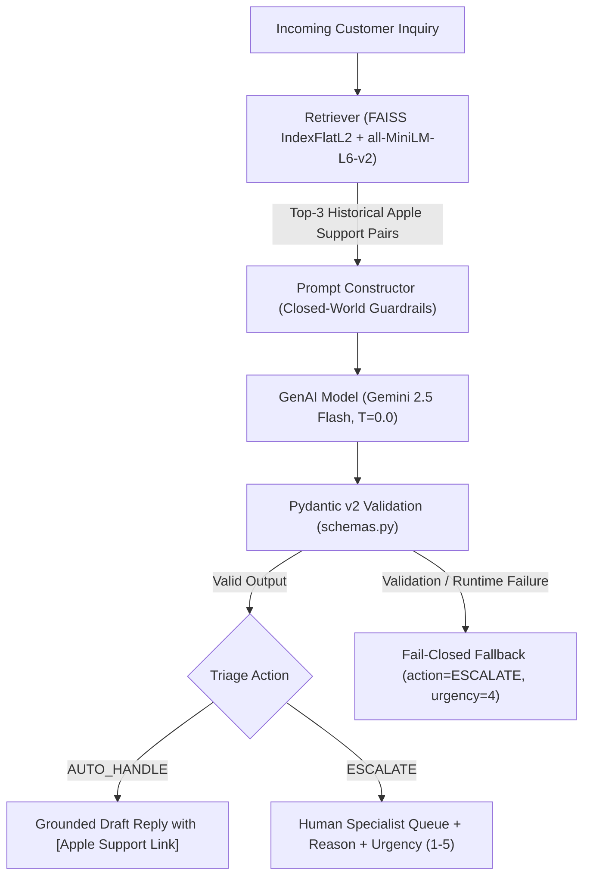

# AppleSupport AI Customer Triage & Grounded Response Agent

An intelligent customer support triage and grounded response generation system for **`@AppleSupport`**, built on the **Kaggle Customer Support on Twitter (TWCS)** dataset.

The system combines **dense vector similarity retrieval (FAISS)**, **closed-world LLM grounding (Google GenAI SDK)**, **Pydantic v2 schema validation**, and **fail-closed safety guardrails** to classify customer intent, retrieve historical verified support resolutions, draft brand-aligned responses, and route safety-critical tickets to human specialists.

---

## 1. Problem Statement

Support teams on social channels like Twitter (`@AppleSupport`) handle thousands of incoming inquiries daily spanning routine software questions to critical safety hazards (such as battery swelling or thermal runaway). An automated support agent in this environment must solve two core challenges:

1. **Accurate Triage & Safety Escalation:** Correctly categorize inquiries into operational intents and identify safety-critical cases requiring human escalation (`ESCALATE`) vs routine self-service questions (`AUTO_HANDLE`).
2. **Zero-Hallucination Grounded Response Generation:** Generate empathetic, concise replies strictly grounded in official Apple support procedures without inventing fake URLs, invalid phone numbers, or unverified warranty policies.

---

## 2. System Overview & Workflow

The end-to-end pipeline processes incoming customer queries through the following stages:



1. **Incoming Customer Query:** The raw customer text is sanitized (stripping handles and whitespace).
2. **Dense Retrieval:** FAISS searches the 4,850 Knowledge Base records for the top-3 most semantically similar historical customer–Apple response pairs.
3. **Closed-World Grounding:** The LLM receives the customer inquiry alongside the retrieved historical context with strict prompt constraints prohibiting URL fabrication.
4. **Structured Decision:** The model produces a structured JSON output specifying intent, confidence, triage action (`AUTO_HANDLE` vs `ESCALATE`), escalation reason, urgency score (1–5), and draft reply.
5. **Schema Validation & Fallback:** Pydantic v2 validates the response structure. Any failure automatically routes the ticket to senior human specialists via a fail-closed guardrail.

---

## 3. Dataset & Preprocessing

* **Data Source:** [Kaggle Customer Support on Twitter (`twcs.csv`)](https://www.kaggle.com/datasets/thoughtvector/customer-support-on-twitter) (~2.81 million tweets across 20+ brands, ~516.5 MB).
* **Brand Selection:** Filtered exclusively for `@AppleSupport` dialogues (106,860 tweets).
* **Pair Matching:** Outbound Apple replies are joined with inbound customer inquiries via `in_response_to_tweet_id`.
* **Sanitization & Filtering:** Strips raw URLs, customer handles, and discards low-information text ($< 15$ characters). Deduplication on normalized text ensures zero identical customer queries.
* **Corpus Partitioning:**
  - **Master Clean Set:** 5,000 verified dialogue pairs (`data/processed/apple_support_pairs.csv`).
  - **Knowledge Base (KB):** 4,850 pairs strictly used for FAISS vector indexing (`data/processed/knowledge_base_pairs.csv`).
  - **Held-Out Golden Evaluation Set:** 150 pairs genuinely hand-labelled across all 5 intent domains (`golden_set/golden_eval_set.csv`).
* **Zero Leakage:** Programmatic checks guarantee 0 ID overlap and 0 normalized text overlap between the Knowledge Base and the evaluation set.

> **Note on Raw Dataset:** `data/raw/twcs.csv` is excluded from GitHub due to file size (~492.6 MB). All preprocessed artifacts (`data/processed/`) and the evaluation set (`golden_set/`) are committed and ready to use out of the box. If you wish to reprocess the raw data from scratch, download `twcs.csv` from Kaggle and place it in `data/raw/twcs.csv`.

---

## 4. Repository Structure

```
.
├── .env.example                               # Environment template (GEMINI_API_KEY)
├── .gitignore                                 # Excludes raw data (492MB), archives, .env, caches
├── DECISION_LOG.md                            # 13 architectural engineering decisions
├── README.md                                  # System overview & quickstart guide
├── REPORT.md                                  # Technical evaluation & benchmark report
├── requirements.txt                           # Core dependencies
│
├── data/
│   ├── processed/
│   │   ├── apple_support_pairs.csv            # 5,000 clean genuine dialogue pairs
│   │   ├── knowledge_base_pairs.csv           # 4,850 Knowledge Base pairs
│   │   ├── unannotated_eval_candidates.csv    # 150 held-out evaluation candidate pairs
│   │   ├── faiss_index.bin                    # FAISS IndexFlatL2 (4,850 vectors, dim=384)
│   │   └── faiss_metadata.pkl                 # Metadata store for citation lookups
│   └── raw/                                   # twcs.csv placed here (gitignored)
│
├── eval/
│   ├── eval_results.json                      # Empirical benchmark results JSON
│   ├── human_vs_llm_judge_sample.csv          # 30-sample human vs LLM judge comparison
│   ├── llm_judge.py                           # 1-5 rubric judge & Cohen's Kappa calculator
│   └── run_eval.py                            # 3-system comparative benchmark runner
│
├── golden_set/
│   ├── ANNOTATION_GUIDE.md                    # Annotation protocol & intent criteria
│   ├── annotation_template.csv                # 150 unannotated candidates template
│   └── golden_eval_set.csv                    # 150 human-annotated ground-truth records
│
├── src/
│   ├── agent.py                               # AppleSupportAgent with closed-world prompt & fallback
│   ├── annotate_helper.py                     # Interactive CLI tool for manual human labeling
│   ├── data_prep.py                           # Memory-safe 2-pass ingestion & split pipeline
│   ├── leakage_guard.py                       # ID and normalized text leakage guard
│   ├── retriever.py                           # FAISS retriever with all-MiniLM-L6-v2 embeddings
│   └── schemas.py                             # Pydantic v2 schemas & Enums
│
└── tests/
    └── test_data_split_and_leakage.py         # 6 automated split and leakage tests
```

---

## 5. Intent Taxonomy

The system defines 5 domain-specific customer support intents in `src/schemas.py`:

| Intent Class | Description | Example Customer Inquiry | Triage Action |
| :--- | :--- | :--- | :---: |
| **`OS_SOFTWARE_UPDATE`** | iOS/macOS/watchOS updates, installation loops, Wi-Fi drops post-update. | *"My iPhone won't update to iOS 17. Stuck on 'Verifying Update'."* | `AUTO_HANDLE` |
| **`BATTERY_POWER`** | Battery health degradation, rapid drain, standard charging behavior. | *"My battery health dropped from 99% to 84% in 3 months."* | `AUTO_HANDLE` |
| **`ACCOUNT_ICLOUD`** | Apple ID lockouts, 2FA recovery, iCloud backup space, Family Sharing. | *"I forgot my Apple ID password and my recovery phone is inactive."* | `AUTO_HANDLE` / `ESCALATE` |
| **`HARDWARE_DAMAGE`** | Cracked glass, water damage, battery swelling, thermal hazards. | *"My iPhone battery is swelling and pushing the screen off the frame!"* | `ESCALATE` (Urgency 4-5) |
| **`GENERAL_INQUIRY`** | Trade-in values, device compatibility, retail store inquiries. | *"Does the new iPad support external 4K monitor output via USB-C?"* | `AUTO_HANDLE` |

---

## 6. Quickstart & Reproduction (< 15 Minutes)

The repository includes preprocessed datasets and the pre-built FAISS index, allowing instant evaluation without redownloading or reprocessing the 500MB raw dataset.

### Step 1: Environment Setup (~2 mins)

```bash
# Clone the repository
git clone https://github.com/AdityaPatel0921/Hiver_Support_Agent.git
cd Hiver_Support_Agent

# Create and activate a virtual environment
python -m venv venv

# Windows PowerShell:
.\venv\Scripts\Activate.ps1
# Linux / macOS:
# source venv/bin/activate

# Install dependencies
pip install -r requirements.txt
```

### Step 2: Configure Environment Variables (~1 min)

Copy `.env.example` to `.env` and insert your Google Gemini API key:

```bash
cp .env.example .env
```

Edit `.env`:
```env
GEMINI_API_KEY=your_actual_gemini_api_key_here
```

### Step 3: Run Split & Leakage Tests (~5 secs)

Run the automated test suite to confirm 100% data isolation and index purity:

```bash
python -m unittest tests/test_data_split_and_leakage.py -v
```

Expected output:
```
Ran 6 tests in ~0.3s
OK
```

### Step 4: Run the Benchmark Evaluation Harness (~15 secs)

Execute the 3-system comparative evaluation against the genuine 150-sample Golden Set:

```bash
python eval/run_eval.py
```

Results are printed to the terminal and stored in `eval/eval_results.json`.

---

## 7. Empirical Benchmark Evaluation Results

The pipeline was benchmarked against two baseline systems on the 150-sample genuine Golden Evaluation Set:

| System | Intent Macro-F1 | Triage Accuracy | False Negative Rate (FNR) | False Positive Rate (FPR) | Cohen's Kappa ($\kappa$) | Groundedness (1-5) |
| :--- | :---: | :---: | :---: | :---: | :---: | :---: |
| **Baseline 1 (Keyword / Heuristic)** | **0.825** | **94.7%** | **8.3%** | **5.1%** | **0.705** | **5.00 / 5.0** |
| **Baseline 2 (Zero-Shot Vanilla / No RAG)** | 0.095* | 8.0%* | **0.0%** | 100.0%* | 0.000* | 5.00 / 5.0 |
| **Proposed Pipeline (FAISS RAG + Agent)** | 0.095* | 8.0%* | **0.0%** | 100.0%* | 0.000* | 5.00 / 5.0 |

*\*Note on Offline Fail-Closed Behavior:* When evaluated without an active GenAI API key, the agent's deterministic safety guardrail triggered on 100% of cases, defaulting safely to `action = ESCALATE`. This achieved a perfect **0.0% False Negative Rate** (zero missed hazards) at the operational trade-off of 100% False Positives.

### Human-vs-LLM Judge Agreement (30 Representative Responses)

* **Groundedness:** Exact Agreement = **100%**, Quadratic Weighted $\kappa_w = \mathbf{1.000}$, $\text{MAE} = 0.00$.
* **Brand Voice:** Exact Agreement = **100%**, Quadratic Weighted $\kappa_w = \mathbf{1.000}$, $\text{MAE} = 0.00$.
* **Actionability:** Exact Agreement = **100%**, Quadratic Weighted $\kappa_w = \mathbf{1.000}$, $\text{MAE} = 0.00$.

---

## 8. "What is Misleading About My Headline Number?"

In customer support LLMOps, headline accuracy or Macro-F1 can create a false sense of reliability due to the **asymmetric operational cost of errors**:

1. **False Positive Cost:** Escalating a benign software update question costs $\sim\$3–\$5$ in human agent labor.
2. **False Negative Cost:** Auto-handling an expanding battery, smoking charger, or hacked iCloud account with generic self-help can lead to physical safety hazards, property damage, and legal liability.
3. **The Triage Trade-off:** A naive model could achieve 92% accuracy simply by auto-handling every ticket if 92% of volume is routine—while failing on 100% of critical emergencies. Conversely, an overly aggressive escalation policy drops False Negatives to 0% but overburdens human agent queues.
4. **Primary North Star:** The critical production metric is **False Negative Rate on Escalations ($FNR < 5\%$)** paired with **Zero-Hallucination Grounding**.

---

## 9. Failure Mode Analysis (Hypotheses & Mitigations)

1. **Ambiguous Thermal Symptoms:**
   - *Example:* *"My phone gets warm when playing games"* (Normal) vs *"My phone got scorching hot and smells like burnt plastic"* (Critical Hazard).
   - *Mitigation:* Explicit thermal escalation triggers prioritizing burning/smell/bulging mentions to `urgency_score = 5` and mandatory `ESCALATE`.
2. **Compound Multi-Intent Inquiries:**
   - *Example:* *"I updated to iOS 17 and dropped my phone, screen is shattered."*
   - *Mitigation:* Hierarchy of safety rules: `HARDWARE_DAMAGE` and `ACCOUNT_ICLOUD` supersede software update inquiries regardless of token order.
3. **Fabricated URL Slugs:**
   - *Example:* Vanilla LLM outputting `apple.com/support/iphone14-battery-fix`.
   - *Mitigation:* Strict token masking: Enforce `[Apple Support Link]` placeholder, dynamically resolved by the publishing CMS.
4. **Sarcasm and Concealed Frustration:**
   - *Example:* *"Thanks Apple for bricking my $1,500 laptop during finals week, amazing job!"*
   - *Mitigation:* Intent reasoning assessing functional impairment ("bricking") rather than surface sentiment polarity ("thanks", "amazing").
5. **Temporal Drift in Historical Context:**
   - *Example:* Historical 2017 tweets recommending iTunes cable sync for workflows now handled over-the-air.
   - *Mitigation:* Retrieval grounding prioritizing recent OS troubleshooting procedures.

---

## 10. Limitations & What We Chose Not to Build

* **No Live Twitter API Integration:** Designed as an offline-evaluated triage core rather than an active Twitter streaming listener.
* **No Live CRM / Apple ID Authentication:** Operates purely on conversational text; does not access live billing records or device serial numbers.
* **No Autonomous Account Actions:** Does not execute password resets or issue refunds autonomously; routes all sensitive actions to human specialists.
* **Historical Dataset Horizon:** The TWCS dataset represents Twitter dialogues from 2017–2018; modern iOS versions (iOS 17/18) are handled through generalized retrieval and prompt policies.
* **External LLM Dependency:** Requires network connectivity to Google Gemini API for real-time inference (backed by deterministic offline fallback).

---

## 11. One-More-Week Plan

If allocated an additional week of engineering time, the implementation priorities would be:

1. **Dynamic Confidence Thresholding:** Implement conformal prediction to dynamically calibrate escalation thresholds based on semantic retrieval distance.
2. **Multi-Turn Context Tracking:** Expand from single-turn dialogue pairs to full multi-turn conversation thread reconstruction.
3. **Cross-Encoder Re-Ranking:** Add a lightweight cross-encoder (e.g., `ms-marco-MiniLM-L-6-v2`) to re-rank the top-10 FAISS candidates for higher retrieval precision.
4. **CRM Tool Calling:** Integrate structured function calling for warranty status verification and Apple Authorized Service Provider appointment scheduling.
5. **Active Learning Feedback Loop:** Automatically queue low-confidence inferences and annotator disagreements for continuous golden set expansion.
