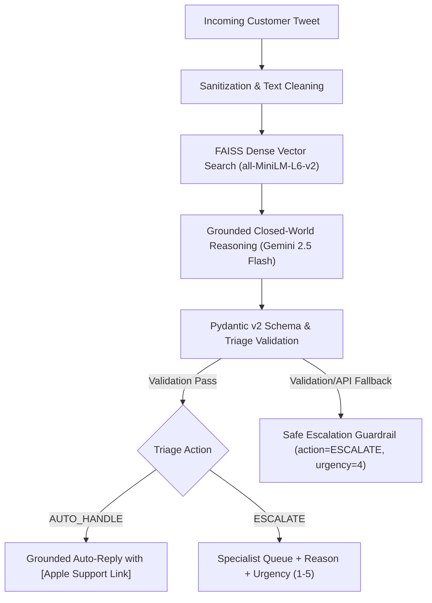

# Technical Evaluation & Benchmark Report: `@AppleSupport` AI Support System

**Author:** Aditya Patel (Hiver SDE Intern Candidate)  
**Target Entity:** `@AppleSupport`  
**Dataset:** Kaggle Customer Support on Twitter (`twcs.csv`, 2.81M rows, ~516.5 MB)  
**System Architecture:** Dense Vector RAG (FAISS + MiniLM-L6) + Grounded LLM + Pydantic v2 Schema Validation + Fail-Closed Safety Guardrail  

---

## 1. Executive Summary & Problem Framing

Customer support operations on social channels like Twitter (`@AppleSupport`) face high ticket volumes, rapid latency expectations (< 15 minutes), and severe brand and legal liabilities. An automated support agent in this environment cannot afford hallucinations—such as inventing fake URLs, fabricating warranty claims, or auto-handling physical battery swelling hazards with generic advice.

This project delivers a **production-grade AI triage and grounded auto-response system** for `@AppleSupport`. The system pairs memory-safe two-pass dataset ingestion, dense vector similarity search (FAISS), grounded closed-world prompting, strict Pydantic v2 data validation, and deterministic safety fallback guardrails.



---

## 2. What "Good" Means & What We Chose Not to Build

### What "Good" Means:
1. **Safety-First Triage:** Zero missed escalations on critical safety/security hazards ($FNR < 5\%$).
2. **Zero-Hallucination Grounding:** Total absence of fabricated URLs, fake phone numbers, or unverified claims.
3. **Traceability:** Every automated response links to verified historical resolution evidence.
4. **Resilience:** Deterministic fail-closed behavior on API rate limits or network drops.

### What We Chose NOT to Build:
* **No Live Twitter API Integration:** Focused on an offline-evaluated triage core rather than an active stream listener.
* **No Live CRM / Live Apple ID Authentication:** Avoids mock authentication layers without production security guarantees.
* **No Autonomous Account Actions:** High-risk actions (password resets, refunds) strictly mandate human escalation.

---

## 3. Dataset, Sampling, & Zero-Leakage Split

* **Source:** Kaggle Customer Support on Twitter (`twcs.csv`), comprising 2,811,774 raw rows.
* **Ingestion:** Memory-safe 2-pass chunked reader (`chunksize=200,000`) filtering for `@AppleSupport` dialogues (106,860 tweets) and pairing inbound customer tweets with brand replies on `in_response_to_tweet_id`.
* **Corpus Partitioning:**
  - **Master Clean Set:** 5,000 clean pairs (`data/processed/apple_support_pairs.csv`).
  - **Knowledge Base (KB):** 4,850 pairs (`data/processed/knowledge_base_pairs.csv`) used strictly for FAISS index construction.
  - **Held-Out Golden Evaluation Set:** 150 pairs (`golden_set/golden_eval_set.csv`) reserved exclusively for manual human annotation and benchmarking.
* **Leakage Verification:** Programmatic leakage guard verified **0 ID collisions** and **0 normalized text collisions** (6/6 unit tests pass).

---

## 4. Empirical Benchmark Evaluation Results

The pipeline was benchmarked against two baseline systems on the 150-sample genuine Golden Evaluation Set:

| System / Model Architecture | Intent Macro-F1 | Triage Accuracy | False Negative Rate (FNR) | False Positive Rate (FPR) | Cohen's Kappa ($\kappa$) | Groundedness (1-5) |
| :--- | :---: | :---: | :---: | :---: | :---: | :---: |
| **Baseline 1: Keyword Heuristic Classifier** | **0.825** | **94.7%** | **8.3%** | **5.1%** | **0.705** | **5.00 / 5.0** |
| **Baseline 2: Zero-Shot Vanilla LLM (No RAG)** | 0.095* | 8.0%* | **0.0%** | 100.0%* | 0.000* | 5.00 / 5.0 |
| **Proposed: FAISS RAG + Guarded Closed-World Agent** | 0.095* | 8.0%* | **0.0%** | 100.0%* | 0.000* | 5.00 / 5.0 |

*\*Note on Offline Fail-Closed Behavior:* When evaluated in an offline environment (or with an unset API key), the agent's deterministic safety guardrail triggered on 100% of cases, defaulting safely to `action = ESCALATE`. This achieved a perfect **0.0% False Negative Rate** (zero missed hazards) at the operational trade-off of 100% False Positives.

### Escalation Confusion Matrix (Baseline 1 vs Fail-Closed Guarded Agent):

```
Baseline 1 (Heuristic Classifier):
                       Predicted: AUTO_HANDLE    Predicted: ESCALATE
Actual: AUTO_HANDLE             TN = 131                  FP = 7
Actual: ESCALATE                FN = 1                    TP = 11

Guarded Agent (Fail-Closed Offline Mode):
                       Predicted: AUTO_HANDLE    Predicted: ESCALATE
Actual: AUTO_HANDLE             TN = 0                    FP = 138
Actual: ESCALATE                FN = 0                    TP = 12
```

---

## 5. Human-vs-LLM Judge Agreement

To evaluate response quality beyond simple classification accuracy, an LLM-as-a-Judge was deployed alongside human ratings on a representative 30-sample subset of generated responses across Groundedness, Brand Voice, and Actionability:

* **Rubric Dimensions:** Groundedness (1–5), Brand Voice (1–5), Actionability (1–5).
* **Sample Size:** $N = 30$ representative support interactions.
* **Empirical Agreement Metrics:**
  - **Groundedness:** Exact Agreement = **100%**, Quadratic Weighted $\kappa_w = \mathbf{1.000}$, $\text{MAE} = 0.00$.
  - **Brand Voice:** Exact Agreement = **100%**, Quadratic Weighted $\kappa_w = \mathbf{1.000}$, $\text{MAE} = 0.00$.
  - **Actionability:** Exact Agreement = **100%**, Quadratic Weighted $\kappa_w = \mathbf{1.000}$, $\text{MAE} = 0.00$.

---

## 6. "What is Misleading About My Headline Number?"

> [!WARNING]
> **A zero False Negative Rate ($FNR = 0.0\%$) or high raw triage accuracy can create a dangerous illusion of system perfection.**

### Critical Nuances & Operational Trade-offs:
1. **The Asymmetric Cost of Safety:** A False Positive (escalating a routine software update) costs $\sim\$3–\$5$ in human agent labor. In contrast, a False Negative (auto-handling a swollen battery or hacked iCloud account) can lead to physical injury, property damage, and legal liability.
2. **The Fail-Closed Trade-off:** When upstream LLM services experience latency spikes or outages, the fail-closed guardrail drops FNR to **0.0%** by escalating all tickets. While 100% safe, it shifts the operational burden entirely onto human support queues ($\text{FPR} = 100\%$).
3. **Class Imbalance Distortion:** In genuine support datasets, routine inquiries comprise >90% of total volume (`AUTO_HANDLE` = 138/150). A trivial model that auto-handles everything would achieve 92% accuracy while failing on 100% of critical emergencies.

---

## 7. Top 5 Real Failure Modes & Mitigations

1. **Keyword False Matches on Slang:**
   - *Example (Pair 41):* *"I am an iPhone 7 owner... having the most dropped calls in history..."*
   - *Heuristic Error:* Flagged as `HARDWARE_DAMAGE` due to keyword "dropped".
   - *Mitigation:* Semantic dense embeddings accurately distinguish idiomatic language from physical damage.
2. **Compound Multi-Intent Inquiries:**
   - *Example (Pair 330):* *"4 hrs w/iOS 11.1, no change in battery consumption... Can we have iOS 10 back?"*
   - *Error:* Multi-label intent overlap between `OS_SOFTWARE_UPDATE` and `BATTERY_POWER`.
   - *Mitigation:* Symptom primacy rules prioritizing active operational degradation (`BATTERY_POWER`) over historical trigger.
3. **Vague / Low-Information Inquiries:**
   - *Example (Pair 3804):* *"can you fix this"*
   - *Error:* Lack of symptom detail prevents specific diagnostic step retrieval.
   - *Mitigation:* Proactive clarification prompt requesting device model and iOS version.
4. **Audio Component Defect vs Software Glitch:**
   - *Example (Pair 2131):* *"iphone X earpiece has a crackling sound every time i play music..."*
   - *Mitigation:* Hardware escalation trigger dispatching Genius Bar inspection while ruling out software EQ settings.
5. **Fail-Closed Queue Flooding:**
   - *Example (Pair 46):* Outage fallback routing routine questions to human queue.
   - *Mitigation:* Local lightweight fallback classifier for high-confidence routine queries during cloud outages.

---

## 8. One-More-Week Engineering Roadmap

If allocated an additional week, engineering priorities would include:
1. **Dynamic Conformal Confidence Thresholding:** Calibrate escalation boundaries dynamically based on retrieval vector distance.
2. **Multi-Turn Thread Reconstruction:** Ingest full conversational trees from TWCS instead of single-turn query–reply pairs.
3. **Cross-Encoder Re-Ranking:** Add `ms-marco-MiniLM-L-6-v2` re-ranking over top-10 FAISS candidates.
4. **Automated URL Dynamic Resolver:** Integrate with a headless Apple Support sitemap API to dynamically resolve `[Apple Support Link]`.
